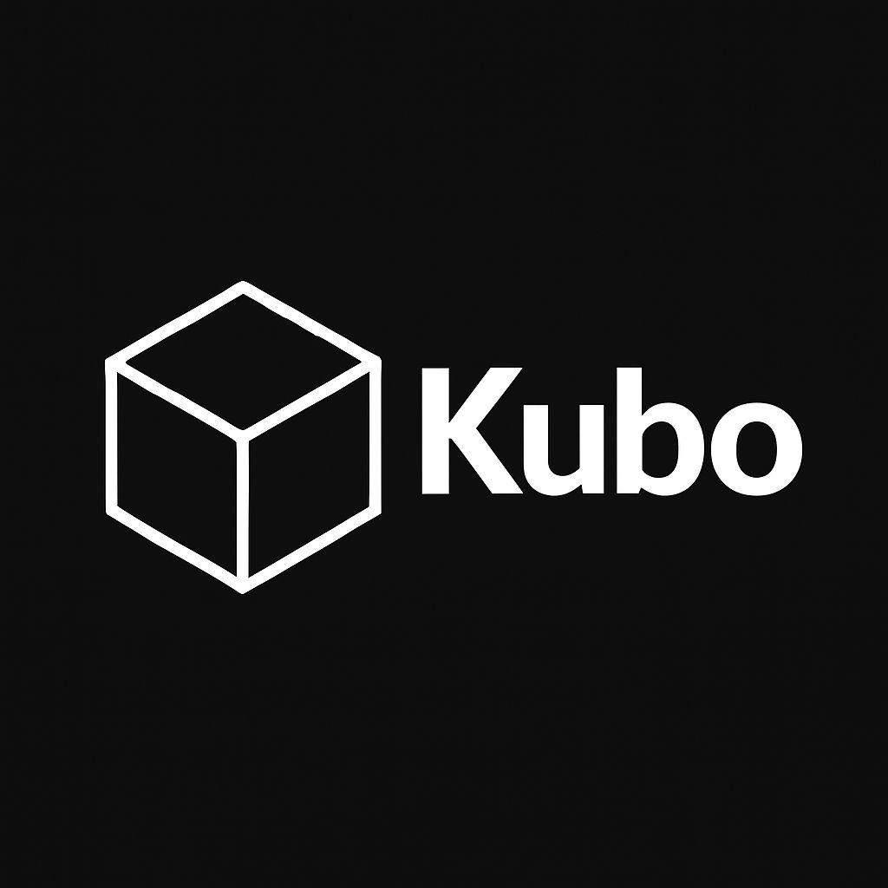

# 🍞 Hola, soy Mr. Toast 👋

**"Just a perfectly toasted slice in a world of raw bread."**

 

<!-- Botón de Instagram -->

  

---

<!-- Tu Logo de Kubo en JPEG -->

### Kubo
> **Proyecto de divulgación técnica para todas las edades.**
> *Desde el cuidado de fuentes de poder hasta la optimización de sistemas.*

---

### Colecciones Destacadas

| Recurso | Descripción | Enlace |
| :--- | :--- | :--- |
| **Software Windows** | Catálogo de software esencial organizado. | [Ver Repo](https://github.com/mrtoasthub/Software-Windows) |
| **IT Support Toolkit** | Herramientas para soporte técnico y helpdesk. | [Ver Repo](https://github.com/mrtoasthub/IT-Support-Helpdesk-Toolkit) |
| **Web Dev Resources** | Curación de assets y utilidades para desarrollo. | [Próximamente] |

 

---

### Sobre este espacio
Este perfil está dedicado a la **divulgación de información, herramientas y recursos educativos** para la comunidad. Todo el contenido compartido tiene fines puramente informativos y busca facilitar el acceso a soluciones tecnológicas de carácter público.

 
